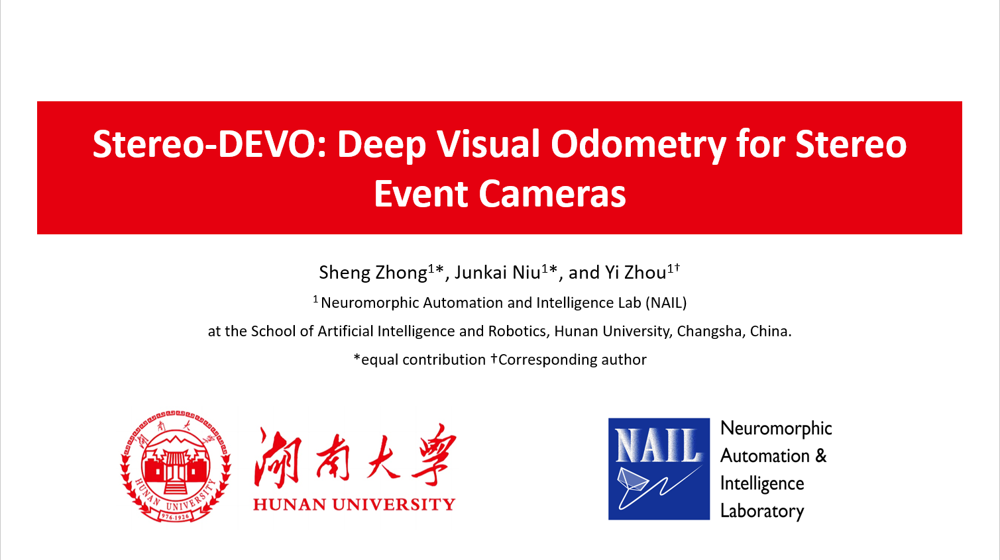

## Deep Visual Odometry for Stereo Event Cameras

### **Video**

 &nbsp;&nbsp;

### **Related Publications**

**[Deep Visual Odometry for Stereo Event Cameras](https://arxiv.org/abs/2509.08235)**, *Junkai Niu, Sheng Zhong, Yi Zhou*, IEEE Robotics and Automation Letters (RA-L), 2025. [PDF](https://arxiv.org/abs/2509.08235), [Video](https://youtu.be/7UykRsmk3Zc).

### Coming Soon

This repository contains the code implementation for our paper titled "Deep Visual Odometry for Stereo Event Cameras", which is expected to be released after IROS 2025.

### Abstract

We present a deep learning-based method for visual odometry using stereo event cameras. The proposed system is built on top of DEVO, a monocular event-only VO system that leverages a learned patch selector and a pooled multinomial sampling for tracking sparse event patches.

### Comparing with us

We encourage comparative evaluations before the release of the full project. If you require the original trajectory data for comparison, feel free to contact us.

### Contact us

For questions or inquiries, please feel free to contact us at bell@hnu.edu.cn.

We appreciate your interest in our work!

### Acknowledgments

We thank the authors of the following repositories for publicly releasing their work:

- [DPVO](https://github.com/princeton-vl/DPVO)
- [DEVO](https://github.com/tum-vision/DEVO)
- [IROS 2025 EvSLAM Challenge](https://nail-hnu.github.io/EvSLAM/)
