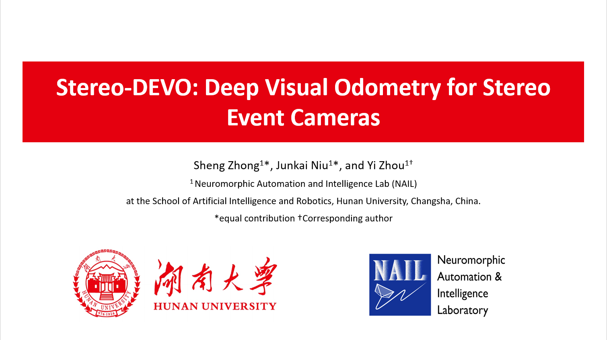

## Deep Visual Odometry for Stereo Event Cameras

### **Video**

[](https://youtu.be/7UykRsmk3Zc) &nbsp;&nbsp;

### **Related Publication**

[1] **[Deep Visual Odometry for Stereo Event Cameras](https://arxiv.org/abs/2509.08235)**, *Sheng Zhong, Junkai Niu, Yi Zhou*, IEEE Robotics and Automation Letters (RA-L), 2025. [PDF](https://arxiv.org/abs/2509.08235), [Video](https://youtu.be/7UykRsmk3Zc).

### 1. Installation

We have tested SDEVO on machines with the following configurations

- Ubuntu 20.04 LTS + ROS Noetic + OpenCV 4.2 + Eigen 3.3.9 + CUDA Toolkit 11.x

#### 1.1 C++ node

First, create a catkin workspace and and download the code into the src directory.

```
cd ~/catkin_ws/src
git clone https://github.com/NAIL-HNU/SDEVO.git
```

Then, configure the environment and install dependencies by following the  [ESVO2](https://github.com/NAIL-HNU/ESVO2) repository. Specific dependency items can be found in the `dependencies.yaml`.

Finally, compile it.

```
cd ~/catkin_ws
catkin_make
```

#### 1.2 Python node

We refer to [DEVO](https://github.com/tum-vision/DEVO) repository and use Anaconda to manage the Python environment.

First, create and activate the Anaconda environment

```bash
conda env create -f environment.yml
conda activate sdevo
```

Then, install the package

```bash
cd ~/DEVO
pip install .
```


### 2. Usage

Since the rosbag with event data is not provided in the datasets, we repackage the required data as the input for the system. You can access most of the rosbag files we repacked through the

After you get the repackaged data, you can try running it using the following command.

```bash
cd ~\catkin_ws
source devel/setup.bash
conda activate sdevo
roslaunch image_representation voxel_xxx.launch
```

This will launch two *image_representation nodes* (for left and right event cameras, respectively), the sdevo node simultaneously. Then play the input (already downloaded) bag file by running

```bash
rosbag play xxx.bag --clock
```

The trajectories will be saved in the path in `/output/poses_interpolated.txt`.

If your hardware cannot support real-time execution of our system, you may modify the rosbag playback rate. However, you must correspondingly adjust the trigger frequency of the periodic signal in the launch file to maintain synchronization:


```xml
<node name="global_timer" pkg="rostopic" type="rostopic" args="pub -s -r 2 /sync std_msgs/Time 'now' ">
```

The frequency of the `global_timer` (in Hz) divided by the rosbag playback rate must equal the voxel generation frequency (`generation_rate_hz`). This relationship maintains temporal consistency between data playback and system processing. 

> *Implementation Notes:*
>
> 1. When decreasing playback rate (slower than real-time), proportionally decrease the `global_timer` frequency 
> 2. When increasing playback rate (faster than real-time), proportionally increase the `global_timer` frequency 
> 3. Always verify the resulting voxel generation rate matches system requirements

### 3. Abstract

We present a deep learning-based method for visual odometry using stereo event cameras. The proposed system is built on top of DEVO, a monocular event-only VO system that leverages a learned patch selector and a pooled multinomial sampling for tracking sparse event patches.

### 4. Comparing with us

We encourage comparative evaluations before the release of the full project. If you require the original trajectory data for comparison, feel free to contact us.

### 5. Contact us

For questions or inquiries, please feel free to contact us at bell@hnu.edu.cn.

We appreciate your interest in our work!

### 6. Acknowledgments

We thank the authors of the following repositories for publicly releasing their work:

- [DPVO](https://github.com/princeton-vl/DPVO)
- [DEVO](https://github.com/tum-vision/DEVO)
- [IROS 2025 EvSLAM Challenge](https://nail-hnu.github.io/EvSLAM/)
- [CVPRW 2025 SLAM Challenge](https://m3ed.io/slam_challenge/)
